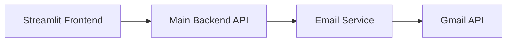
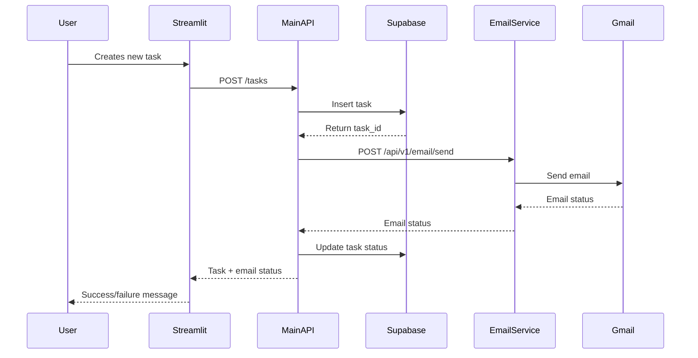

# Task Manager System Architecture

## Overview
The Task Manager system consists of three main components:
1. Frontend (Streamlit App) - Port 8501
2. Main Backend (FastAPI) - Port 8000
3. Email Service (FastAPI) - Port 8002

## Service Architecture



## Data Flow

### 1. Task Creation Flow


## Service Details

### 1. Streamlit Frontend (Port 8501)
- **Purpose**: User interface for task management
- **Location**: `/task-manager-frontend`
- **Features**:
  - Task creation form
  - Task list display
  - Email notification status

### 2. Main Backend API (Port 8000)
- **Purpose**: Core business logic and data management
- **Location**: `/task-manager-api`
- **Key Endpoints**:
  ```
  POST /tasks/
  GET /tasks/
  GET /tasks/{task_id}
  ```
- **Database**: Supabase
- **Environment Variables**:
  ```
  SUPABASE_URL=your_url
  SUPABASE_KEY=your_key
  EMAIL_SERVICE_URL=http://localhost:8002
  ```

### 3. Email Service (Port 8002)
- **Purpose**: Handle all email communications
- **Location**: `/task-manager-email`
- **Key Endpoints**:
  ```
  POST /api/v1/email/send
  GET /api/v1/email/status/{message_id}
  ```
- **Dependencies**: Gmail API
- **Environment Variables**:
  ```
  GOOGLE_CLIENT_ID=your_id
  GOOGLE_CLIENT_SECRET=your_secret
  GOOGLE_REFRESH_TOKEN=your_token
  EMAIL_SENDER=your@email.com
  EMAIL_SENDER_NAME="Task Manager"
  ```

## Request/Response Examples

### 1. Creating a Task (Main API)
```json
// POST /tasks/
Request:
{
    "title": "Example Task",
    "description": "Task description",
    "priority": 1,
    "email_to": "user@example.com",
    "email_subject": "New Task",
    "email_body": "Task details..."
}

Response:
{
    "task_id": "123",
    "status": "email_sent",
    "task": {
        "id": "123",
        "title": "Example Task",
        ...
    }
}
```

### 2. Sending Email (Email Service)
```json
// POST /api/v1/email/send
Request:
{
    "to": "user@example.com",
    "subject": "Task: Complete documentation",
    "task_id": "123",
    "task_title": "Complete documentation",
    "task_description": "Write technical documentation...",
    "priority": 1
}

Response:
{
    "status": "sent",
    "message_id": "unique_message_id",
    "timestamp": "2024-02-20T15:36:44.857Z"
}
```

## Starting the Services

1. Start Email Service:
```bash
cd task-manager-email
uvicorn app.main:app --port 8002 --reload
```

2. Start Main API:
```bash
cd task-manager-api
uvicorn api.main:app --port 8000 --reload
```

3. Start Streamlit:
```bash
cd task-manager-frontend
streamlit run app.py
```

## Error Handling

1. Email Service Errors:
   - Connection failures
   - Gmail API errors
   - Invalid email format

2. Main API Errors:
   - Database connection issues
   - Email service unavailable
   - Invalid task data

## Security Considerations

1. API Keys and Secrets:
   - All sensitive data in `.env` files
   - `.gitignore` configured properly
   - No hardcoded credentials

2. CORS Configuration:
   - Email Service: Allows main API
   - Main API: Allows Streamlit frontend

## Monitoring and Debugging

1. Email Service Logs:
   - Gmail API interactions
   - Email delivery status
   - Service initialization

2. Main API Logs:
   - Task operations
   - Email service interactions
   - Database operations 