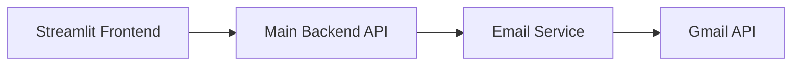
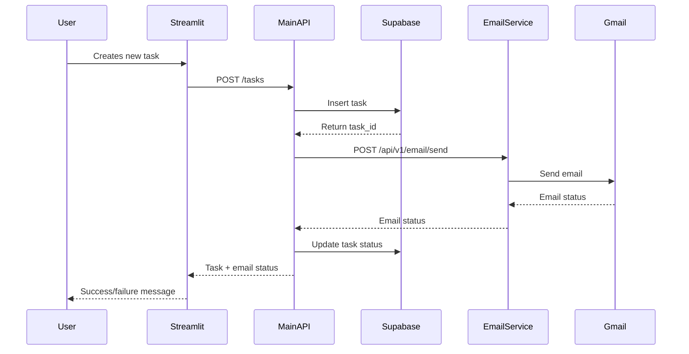
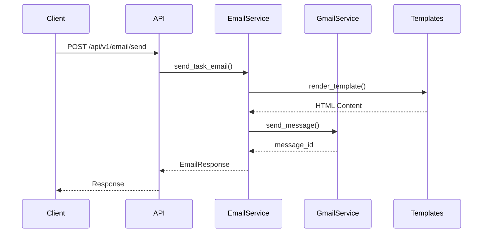
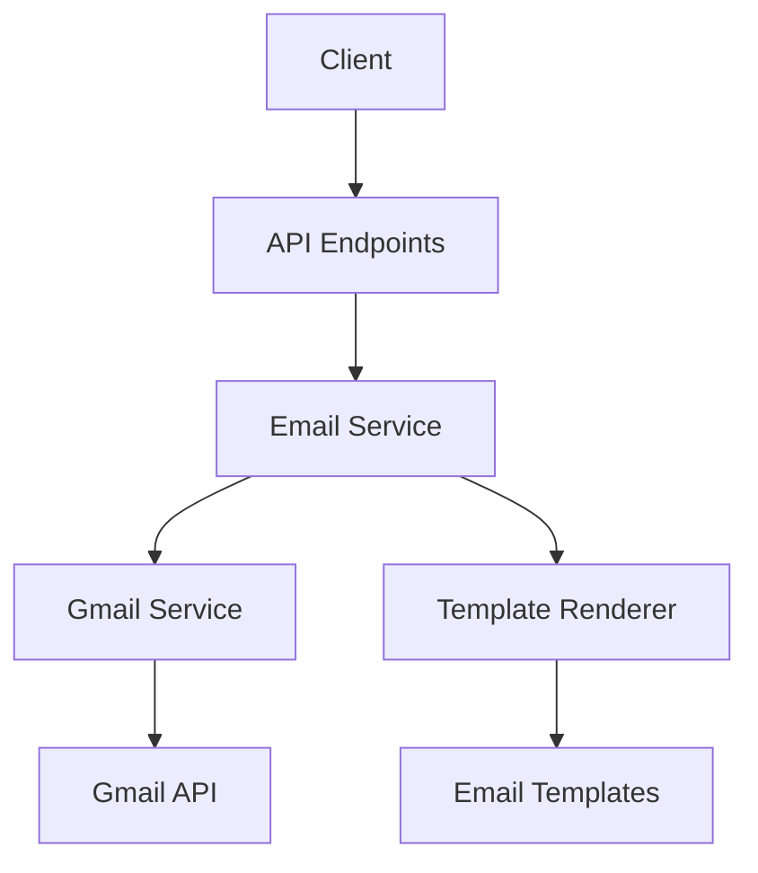

# Task Manager System Architecture

## Overview
The Task Manager system consists of three main components:
1. Frontend (Streamlit App) - Port 8501
2. Main Backend (FastAPI) - Port 8000
3. Email Service (FastAPI) - Port 8002

## Service Architecture



## Data Flow

### 1. Task Creation Flow


## Service Details

### 1. Streamlit Frontend (Port 8501)
- **Purpose**: User interface for task management
- **Location**: `/task-manager-frontend`
- **Features**:
  - Task creation form
  - Task list display
  - Email notification status

### 2. Main Backend API (Port 8000)
- **Purpose**: Core business logic and data management
- **Location**: `/task-manager-api`
- **Key Endpoints**:
  ```
  POST /tasks/
  GET /tasks/
  GET /tasks/{task_id}
  ```
- **Database**: Supabase
- **Environment Variables**:
  ```
  SUPABASE_URL=your_url
  SUPABASE_KEY=your_key
  EMAIL_SERVICE_URL=http://localhost:8002
  ```

### 3. Email Service (Port 8002)
- **Purpose**: Handle all email communications
- **Location**: `/task-manager-email`
- **Key Endpoints**:
  ```
  POST /api/v1/email/send
  GET /api/v1/email/status/{message_id}
  ```
- **Dependencies**: Gmail API
- **Environment Variables**:
  ```
  GOOGLE_CLIENT_ID=your_id
  GOOGLE_CLIENT_SECRET=your_secret
  GOOGLE_REFRESH_TOKEN=your_token
  EMAIL_SENDER=your@email.com
  EMAIL_SENDER_NAME="Task Manager"
  ```

## Request/Response Examples

### 1. Creating a Task (Main API)
```json
// POST /tasks/
Request:
{
    "title": "Example Task",
    "description": "Task description",
    "priority": 1,
    "email_to": "user@example.com",
    "email_subject": "New Task",
    "email_body": "Task details..."
}

Response:
{
    "task_id": "123",
    "status": "email_sent",
    "task": {
        "id": "123",
        "title": "Example Task",
        ...
    }
}
```

### 2. Sending Email (Email Service)
```json
// POST /api/v1/email/send
Request:
{
    "to": "user@example.com",
    "subject": "Task: Complete documentation",
    "task_id": "123",
    "task_title": "Complete documentation",
    "task_description": "Write technical documentation...",
    "priority": 1
}

Response:
{
    "status": "sent",
    "message_id": "unique_message_id",
    "timestamp": "2024-02-20T15:36:44.857Z"
}
```

## Starting the Services

1. Start Email Service:
```bash
cd task-manager-email
uvicorn app.main:app --port 8002 --reload
```

2. Start Main API:
```bash
cd task-manager-api
uvicorn api.main:app --port 8000 --reload
```

3. Start Streamlit:
```bash
cd task-manager-frontend
streamlit run app.py
```

## Error Handling

1. Email Service Errors:
   - Connection failures
   - Gmail API errors
   - Invalid email format

2. Main API Errors:
   - Database connection issues
   - Email service unavailable
   - Invalid task data

## Security Considerations

1. API Keys and Secrets:
   - All sensitive data in `.env` files
   - `.gitignore` configured properly
   - No hardcoded credentials

2. CORS Configuration:
   - Email Service: Allows main API
   - Main API: Allows Streamlit frontend

## Monitoring and Debugging

1. Email Service Logs:
   - Gmail API interactions
   - Email delivery status
   - Service initialization

2. Main API Logs:
   - Task operations
   - Email service interactions
   - Database operations

# Task Manager Email Service Architecture

## Overview

The Task Manager Email Service is a microservice responsible for sending email notifications for tasks. It uses Gmail API for sending emails and provides a RESTful API interface for the main Task Manager application.

## Directory Structure

```
task-manager-email/
├── app/
│   ├── api/
│   │   └── v1/
│   │       └── endpoints/
│   │           └── email.py       # Email API endpoints
│   │   ├── core/
│   │   │   ├── config.py             # Configuration settings
│   │   │   └── gmail.py              # Gmail service integration
│   │   ├── models/
│   │   │   └── email.py              # Data models for email
│   │   ├── services/
│   │   │   └── email.py              # Email business logic
│   │   ├── templates/
│   │   │   ├── base.html             # Base email template
│   │   │   └── email_templates/
│   │   │   └── task_notification.html  # Task notification template
│   │   ├── utils/
│   │   │   └── template.py           # Template rendering utilities
│   │   └── main.py                   # FastAPI application entry point
│   ├── credentials/                   # Gmail API credentials
│   ├── tests/                        # Test files
│   └── .env                          # Environment variables
```

## Component Descriptions

### 1. API Layer (`app/api/v1/endpoints/email.py`)
- Handles HTTP requests for email operations
- Defines REST endpoints for sending emails and checking status
- Routes:
  - POST `/api/v1/email/send`: Send task notification emails
  - GET `/api/v1/email/status/{message_id}`: Check email status

### 2. Core Components

#### Configuration (`app/core/config.py`)
- Manages application settings using Pydantic
- Loads environment variables
- Defines service configuration:
  - Gmail API credentials
  - Email sender details
  - Service ports and URLs
  - CORS settings

#### Gmail Service (`app/core/gmail.py`)
- Handles Gmail API integration
- Manages OAuth2 authentication
- Provides methods for:
  - Creating email messages
  - Sending emails via Gmail API
  - Managing credentials

### 3. Data Models (`app/models/email.py`)
- Defines Pydantic models for:
  - EmailRequest: Input data for sending emails
  - EmailResponse: Response data after sending
  - EmailStatus: Enum for email states
  - Priority: Task priority levels

### 4. Business Logic (`app/services/email.py`)
- Implements email sending logic
- Handles template rendering
- Manages error handling and logging
- Provides status tracking

### 5. Templates
- `base.html`: Base template with common styling
- `task_notification.html`: Task-specific email template

### 6. Utilities (`app/utils/template.py`)
- Provides Jinja2 template rendering
- Manages template loading and context

## Flow Diagrams

### 1. Email Sending Flow



### 2. Component Interaction



## Authentication Flow

1. Initial Setup:
   - Store Gmail API credentials in `credentials/`
   - Configure OAuth2 settings in `.env`

2. Runtime Flow:
   - Load credentials from token.pickle
   - Refresh token if expired
   - Create new credentials if needed

## Error Handling

The service implements comprehensive error handling:
- Template rendering errors
- Gmail API errors
- Authentication failures
- Invalid request data

## Configuration

### Environment Variables
```env
GOOGLE_CLIENT_ID=your_client_id
GOOGLE_CLIENT_SECRET=your_client_secret
GOOGLE_REFRESH_TOKEN=your_refresh_token
EMAIL_SENDER=sender@email.com
EMAIL_SENDER_NAME="Task Manager"
PORT=8002
```

## API Endpoints

### Send Email
```http
POST /api/v1/email/send
Content-Type: application/json

{
    "to": "recipient@email.com",
    "subject": "Task Update",
    "task_id": "123",
    "task_title": "Example Task",
    "task_description": "Task details",
    "priority": 1
}
```

### Check Status
```http
GET /api/v1/email/status/{message_id}
```

## Security Considerations

1. Credentials Protection:
   - Sensitive files in `.gitignore`
   - Credentials stored in secure directory
   - Environment variables for secrets

2. API Security:
   - CORS configuration
   - Input validation
   - Error message sanitization 