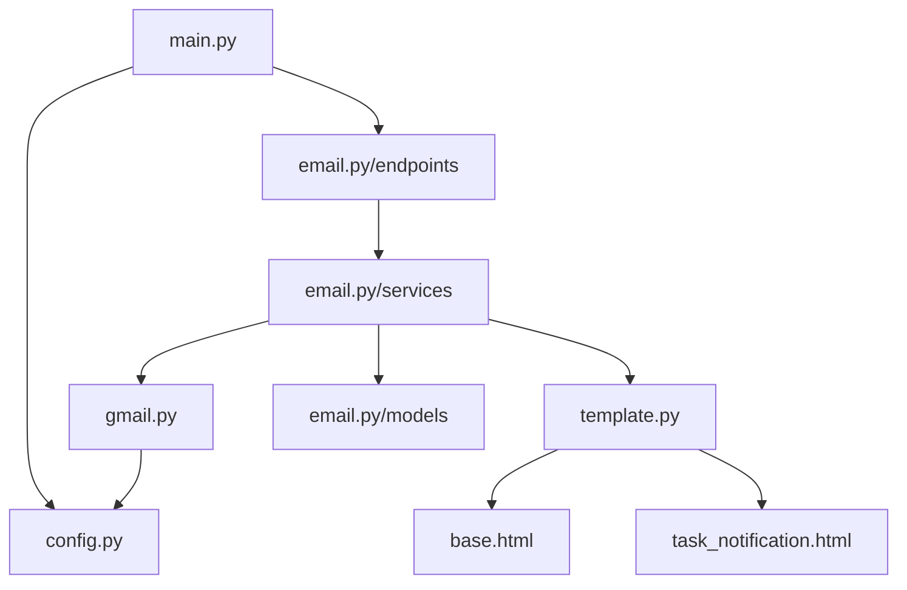
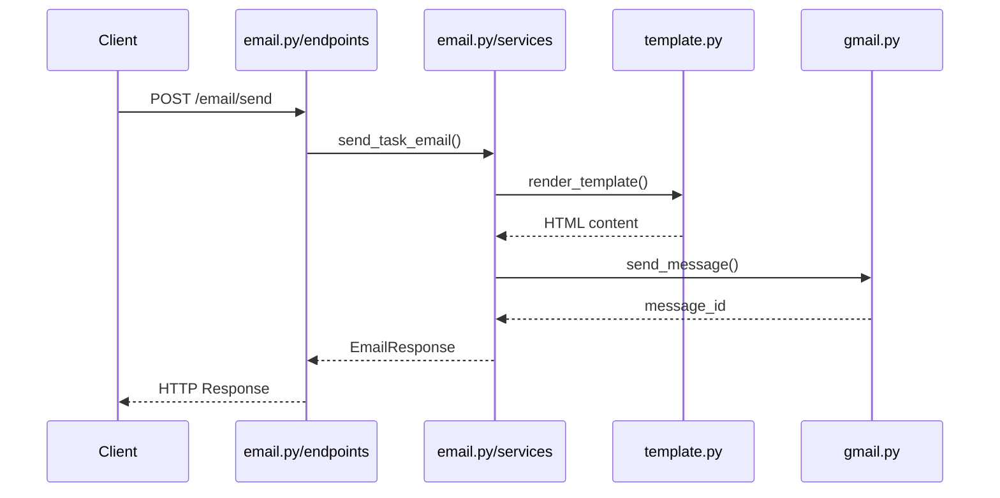
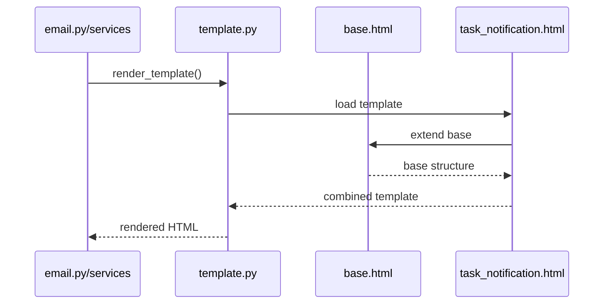
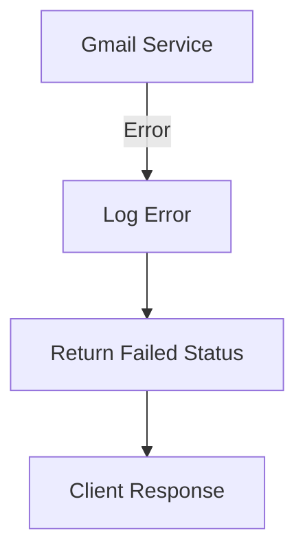
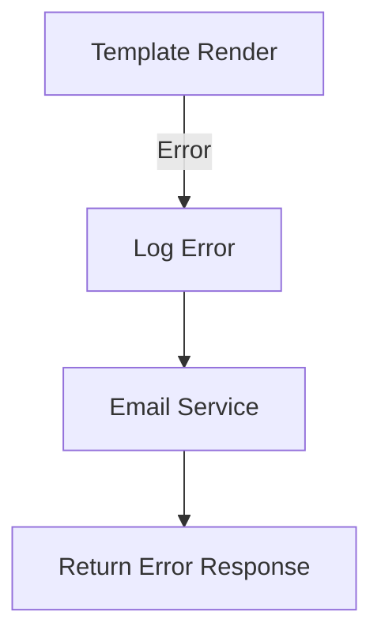

# Detailed File Documentation

## File Structure and Dependencies

## Core Files

### 1. `app/main.py`
**Purpose**: Application entry point
**Dependencies**:
- `app.core.config`: For application settings
- `app.api.v1.endpoints.email`: For email routes
**Key Functions**:
- Initializes FastAPI application
- Configures CORS middleware
- Includes email router
- Sets up logging
**Connected To**: 
- Email endpoints
- Configuration settings
- CORS middleware

### 2. `app/core/config.py`
**Purpose**: Configuration management
**Dependencies**:
- `pydantic_settings`: For settings management
**Key Settings**:
- Environment settings
- Port configuration
- CORS origins
- Gmail API credentials
- Email sender details
**Used By**:
- `main.py` for app configuration
- `gmail.py` for API credentials
- All components needing settings

### 3. `app/core/gmail.py`
**Purpose**: Gmail API integration
**Dependencies**:
- `google.oauth2.credentials`: For OAuth2
- `googleapiclient.discovery`: For Gmail API
- `app.core.config`: For credentials
**Key Functions**:
- `_initialize_service()`: Sets up Gmail API connection
- `create_message()`: Creates email messages
- `send_message()`: Sends emails
**Connected To**:
- Gmail API
- Configuration settings
- Email service

## API Layer

### 4. `app/api/v1/endpoints/email.py`
**Purpose**: Email API endpoints
**Dependencies**:
- `fastapi`: For API routes
- `app.services.email`: For email service
- `app.models.email`: For data models
**Key Endpoints**:
- POST `/api/v1/email/send`: Send emails
- GET `/api/v1/email/status/{message_id}`: Check status
**Connected To**:
- Email service
- Email models
- FastAPI router

## Service Layer

### 5. `app/services/email.py`
**Purpose**: Email business logic
**Dependencies**:
- `app.core.gmail`: For Gmail service
- `app.models.email`: For data models
- `app.utils.template`: For email templates
**Key Functions**:
- `send_task_email()`: Main email sending logic
- `get_email_status()`: Status checking
**Connected To**:
- Gmail service
- Template renderer
- Email models

## Models

### 6. `app/models/email.py`
**Purpose**: Data models and validation
**Dependencies**:
- `pydantic`: For data validation
**Key Models**:
- `EmailRequest`: Input validation
- `EmailResponse`: Response format
- `EmailStatus`: Status enumeration
- `Priority`: Priority levels
**Used By**:
- Email endpoints
- Email service
- Template renderer

## Templates

### 7. `app/templates/base.html`
**Purpose**: Base email template
**Dependencies**: None
**Key Features**:
- Common HTML structure
- Shared CSS styles
- Header and footer
**Used By**:
- Task notification template
- Future email templates

### 8. `app/templates/email_templates/task_notification.html`
**Purpose**: Task-specific email template
**Dependencies**:
- `base.html`: Extends base template
**Key Features**:
- Task details layout
- Priority styling
- Dynamic content areas
**Used By**:
- Email service for task notifications

## Utilities

### 9. `app/utils/template.py`
**Purpose**: Template rendering
**Dependencies**:
- `jinja2`: For template engine
**Key Functions**:
- `render_template()`: Renders HTML templates
**Connected To**:
- Email templates
- Email service

## Configuration Files

### 10. `.env`
**Purpose**: Environment variables
**Contains**:
- Gmail API credentials
- Service configuration
- Email settings
**Used By**:
- Configuration module
- Should never be committed

### 11. `.gitignore`
**Purpose**: Git ignore rules
**Key Rules**:
- Python artifacts
- Environment files
- Credentials
- Logs
**Protects**:
- Sensitive credentials
- Local configurations
- Cache files

## Data Flow Examples

### 1. Sending an Email

### 2. Template Rendering

## Error Handling Flow

### 1. Gmail API Errors

### 2. Template Errors

## Security Considerations

### 1. Credential Management
- Credentials stored in `credentials/`
- Token refresh handled by `gmail.py`
- Environment variables in `.env`

### 2. Error Handling
- Detailed logging in each component
- Error abstraction in responses
- Secure error messages

## Testing Strategy

Each file should have a corresponding test file in `tests/`:
- `test_email_endpoints.py`
- `test_email_service.py`
- `test_gmail_service.py`
- `test_template_renderer.py` 